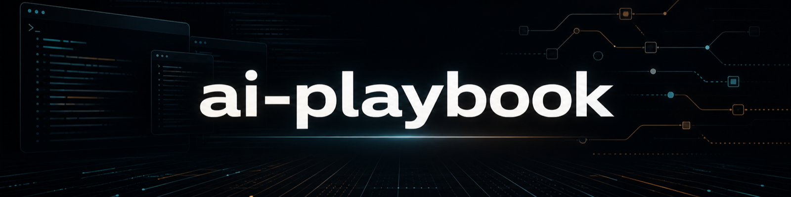

<h2 align="center">A shared understanding for your coding agent</h2>

<p align="center">Your project. Your rules. Three Markdown files.</p>

<p align="center">
  <a href="https://github.com/Vadimkomis/ai-playbook/actions/workflows/test.yml"></a>
  <a href="LICENSE"></a>
</p>

<p align="center">
  <a href="#get-started">Get started</a> ·
  <a href="#installation-walkthrough">Watch the walkthrough</a> ·
  <a href="#documentation">Documentation</a> ·
  <a href="#contributing">Contributing</a>
</p>

ai-playbook turns a short setup conversation into three editable Markdown files.
They work with any coding agent, language or framework. Existing project files
and instructions are preserved.

| File | What it gives your agent |
| --- | --- |
| `AGENTS.md` | Working rules, checks, review steps and your commit/push policy |
| `ARCHITECTURE.md` | The project's purpose, code structure and important boundaries |
| `memory.md` | Lasting decisions, recurring pitfalls and useful links |

## Get started

### Homebrew

Install ai-playbook once, then run setup in an existing project folder:

```sh
brew install vadimkomis/tap/ai-playbook
ai-playbook --target "/path/to/your-project"
```

Homebrew manages Node.js for you. The first Homebrew package is a preview of the
guided setup shown here. Answer the questions, then check your installation:

```sh
ai-playbook doctor --target "/path/to/your-project"
```

To update the tool later, run `brew update` and `brew upgrade ai-playbook`.

<details>
<summary>Install from source (Node.js 22+)</summary>

You'll need **Node.js 22 or newer**.

1. Download this repository using **Code → Download ZIP** on the GitHub branch
   you're viewing, then extract it. If you clone instead, check out that branch.
2. Open the ai-playbook folder in a terminal and run the command below, replacing
   the target path with your project's folder:

   ```sh
   node bin/ai-playbook.js --target "/path/to/your-project"
   ```

3. Answer the questions about your project, checks, safeguards, review and Git
   policy. Accept a suggested answer with Enter, or type your own.

Setup records your answers; it does not run your project's commands. Check the
installed files with:

```sh
node bin/ai-playbook.js doctor --target "/path/to/your-project"
```

</details>

Without Node.js, ask your coding agent to follow [SETUP.md](SETUP.md).

Open your coding agent in **your project folder** and say:

```text
Read AGENTS.md, then help me [describe your task].
```

## Installation walkthrough

https://github.com/user-attachments/assets/92f41acb-470b-4654-aeed-87712bfc5281

[Download the MP4](assets/setup-walkthrough.mp4) · [Read the walkthrough](docs/setup-walkthrough.md)

Follow a real setup from the first command through the questions, generated files
and installation check. The video has on-screen explanations and no audio.

## Make it yours

Edit the three files as your project evolves. Setup keeps existing guidance when
run again; update established rules in the files themselves.

Add specialist workflows, feature/evaluation templates, or Codex and Claude
integrations when you need them.

## Documentation

[Manual setup](SETUP.md) · [Optional integrations](docs/integrations.md) ·
[Development workflow](docs/development/workflow.md) · [Verification](docs/development/verification.md)

## Contributing

Bug reports, documentation improvements and pull requests are welcome.
[Open an issue](https://github.com/Vadimkomis/ai-playbook/issues) to report a problem
or discuss a larger change before implementing it.

For a code change, install development dependencies and run the tests:

```sh
pnpm install
npm test
```

Keep changes focused, preserve existing project files, and include regression
tests when behavior changes. Follow the [development workflow](docs/development/workflow.md)
and [verification guide](docs/development/verification.md), then open a pull
request describing the change and the checks you ran.

## Contributors

Thanks to everyone who helps improve ai-playbook. See the
[people behind the project](https://github.com/Vadimkomis/ai-playbook/graphs/contributors).

Licensed under the [MIT license](LICENSE).
